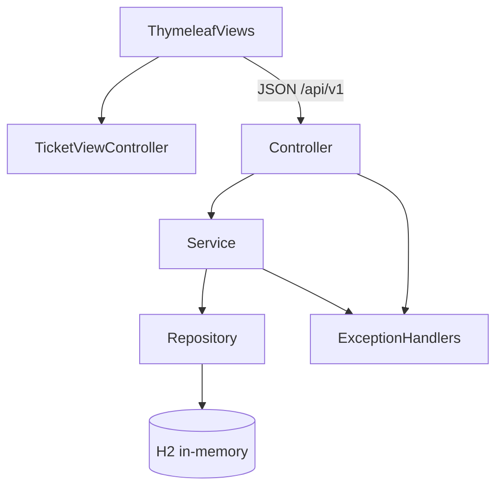

# STMS architecture

Specification only. No application implementation in this document’s delivery.

Stack: Java 21, Spring Boot, in-memory H2, JSON API at `/api/v1`, and a server-rendered Thymeleaf frontend. Packages: `com.c2.stms`. Constructor injection, records for DTOs, layers as below.

The current Maven tree is a **single module**. Use a **layered** package layout now. Split into Maven modules later only if binary boundaries are needed; module names should mirror these layers.

---

## 1. Backend layers

```text
HTTP → Controller → Service → Repository → H2 (in-memory)
                ↘ DTO mapping
Exception → Handler (@ControllerAdvice) → standard error JSON
```



### 1.1 Controller

- Package: `com.c2.stms.controller` (ticket and comment resources).
- Thin HTTP adapter: map requests to service calls, return DTO bodies and status codes.
- No business rules, no JPA types in method signatures.
- Bean Validation annotations on request DTOs (`@Valid`).
- `@RestController` classes expose `/api/v1`; `TicketViewController` handles HTML routes and returns Thymeleaf templates.
- View controllers contain routing/model setup only; ticket rules stay in services/domain.

### 1.2 Service

- Package: `com.c2.stms.service` (application use-cases) with domain rules in `com.c2.stms.domain` (status machine, ticket invariants).
- Orchestrates create, list, patch, search/filter, comment.
- Enforces the status machine from [state-machine.md](state-machine.md). Throws a domain conflict exception on illegal transitions (mapped to **409**).
- Domain must not import Spring Web. Prefer persistence entities in infrastructure; if JPA types leak, keep rules in domain/service, not in repositories.

### 1.3 Repository

- Package: `com.c2.stms.infrastructure` (or `com.c2.stms.repository` for Spring Data interfaces).
- Spring Data JPA repositories and query methods for list/search/filter/pagination.
- No HTTP or DTO knowledge.

### 1.4 DTOs

- Package: `com.c2.stms.api` (or `dto`).
- Java **records** for request and response payloads (`CreateTicketRequest`, `PatchTicketRequest`, `TicketResponse`, `CommentResponse`, paged list wrapper, `ApiError`).
- Mapping: controller/service boundary. Do not expose JPA entities on the wire.

### 1.5 Handlers

- Package: `com.c2.stms.controller` (or `com.c2.stms.api`).
- `@ControllerAdvice` exception handlers:
  - validation → **400** `VALIDATION_ERROR`
  - not found → **404** `TICKET_NOT_FOUND`
  - illegal transition → **409** `ILLEGAL_TICKET_TRANSITION`
  - unauthenticated / forbidden → **401** / **403**
  - uncaught → **500** generic message (no stack traces)
- Error JSON: `timestamp`, `status`, `error`, `message`, `path`, `code`.

### 1.6 Suggested package tree

```text
com.c2.stms
  controller    TicketController, CommentController, GlobalExceptionHandler
  api           request/response records, ApiError
  service       TicketService, CommentService
  domain        TicketStatus, TicketStateMachine, InvalidStateTransitionException
  infrastructure  TicketEntity, CommentEntity, Spring Data repositories
```

Optional later multi-module split: `stms-api`, `stms-domain`, `stms-application`, `stms-infrastructure`, `stms-web` — same dependencies (web → application → domain; infrastructure implements domain ports).

---

## 2. Thymeleaf frontend layout

Spring MVC serves Thymeleaf pages from the same application. Pages may call `/api/v1` for ticket data and mutations. No ticket business rules belong in templates or browser JavaScript; the API remains authoritative and returns structured errors.

```text
src/main/
  java/com/c2/stms/controller/
    TicketViewController.java
  resources/
    templates/
      layout.html              shared head, navigation, page fragment
      tickets/
        list.html              list, search, filters, pagination
        create.html            create form
        detail.html            ticket fields, status, comments
    static/
      css/app.css
      js/                      optional API integration scripts
```

### 2.1 Screens vs API

| Screen | API |
|--------|-----|
| Ticket list | `GET /api/v1/tickets` with `q`, filters, page |
| Create ticket | `POST /api/v1/tickets` |
| Ticket detail | `GET /api/v1/tickets/{id}` |
| Edit fields / status | `PATCH /api/v1/tickets/{id}` |
| Add comment | `POST /api/v1/tickets/{id}/comments` |
| Comment history | included on detail or `GET .../comments` |

Illegal status options must be disabled in the UI **and** still handled as **409** if the API rejects them.

### 2.2 Integration

- Same-origin Thymeleaf pages use relative `/api/v1/...` URLs and do not require CORS.
- Server-rendered form handlers use the temporary configured identity
  `stms.views.actor-id` (`STMS_VIEW_ACTOR_ID`, default `1`) until session authentication
  is implemented. This identity is for local development and is not an authorization model.
- JSON API mutations continue to require the `X-Actor-Id` development header.
- If a separate client is introduced later, allow only its configured origin; never wildcard CORS.
- Escape user content using Thymeleaf’s normal `th:text`; do not use `th:utext` for ticket input.

---

## 3. Data

H2 is the application datastore and runs in PostgreSQL compatibility mode. Hibernate creates and updates the ticket and comment tables from the JPA mappings. The database remains available while the application JVM is running (`DB_CLOSE_DELAY=-1`) but, because it is in memory, data is lost when the JVM exits.

The development-only H2 web console is available at `/h2-console` and connects with JDBC URL `jdbc:h2:mem:ticketdb`, user `sa`, and a blank password. It must not be exposed as a production administration interface.

Ticket and comment tables match §1 of `spec/requirements.md`. Indexes: `status`, `priority`, `assignee_id`, `reporter_id`, and `created_at`; keyword search uses portable case-insensitive matching over title and description.

---

## 4. Alignment with steering

- Java 21, records, constructor injection: `.cursor/rules/java-springboot.mdc`
- REST, errors, 409 transitions: `.cursor/rules/api-standards.mdc`
- Tests (`*Test` / `*IT`, state machine): `.cursor/rules/testing.mdc`
